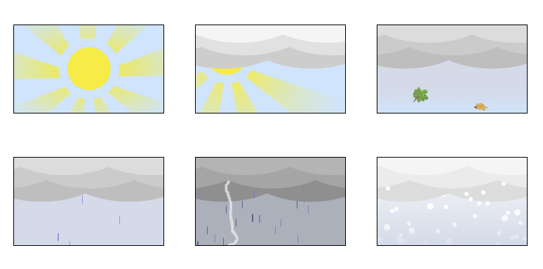

# Weather Cards

Animated weather cards created using basic HTML + CSS + a little JS magic. I made them primarily for my blog, where the end goal is to display a weather card based on weather codes sourced from [Open-Meteo API](https://open-meteo.com/).

For leaves and lightning bolt, I opted for pixel art created via [Pixel Art to CSS](https://pixelartcss.com/) instead of actual images.

All cards are hard-coded to 170x100px size.

#### Link wmo to weather .js
[Open-Meteo API](https://open-meteo.com/) is one of few weather APIs that doesn't need (paid) API key for historical data. Based on location and date it returns both daily and hourly wmo codes. I could just take the daily code and link it to the weather card and be done, however, I found it to not be accurate (not accurate for my purpose). That's why I take hourly codes and modify them -> I work with only day-time codes, I don't differentiate between codes in one range (e.g. codes 60-69 are heavy rain) and the whole thing is a little bit 'dramatic' (it might have not been objectively _that sunny_  that day but all photos show clear skies and so that's what I want the weather cards to show). The linkwmotoweather.js file ends with printing the weather to the console, in my blog injects HTML code into its place.

